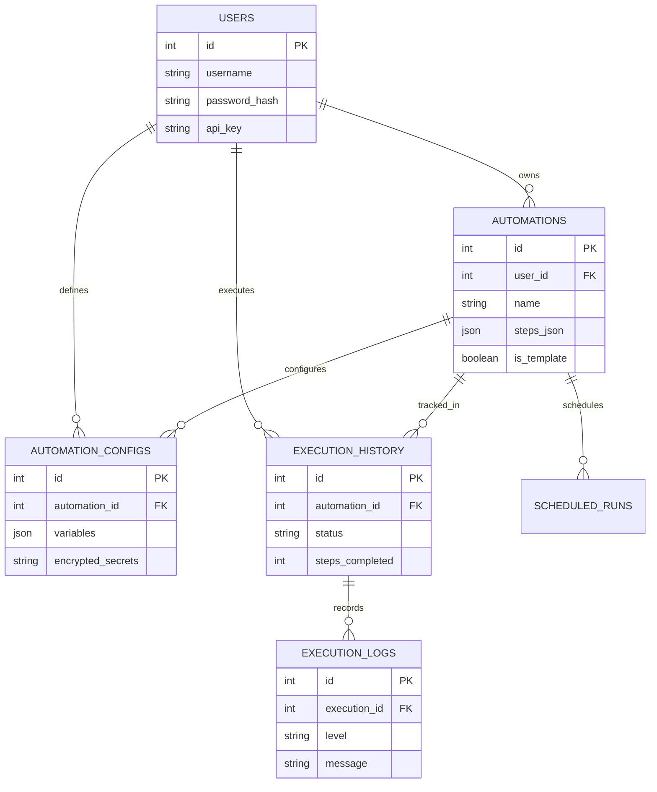

# System Patterns — WebAI Platform

## High-Level Architecture

```mermaid
flowchart TB
    User([👤 User Browser])

    subgraph Dashboard ["🖥️ Face: Dashboard Server (webai_dashboard, port 8080)"]
        SPA["Static SPA (index.html / app.js)"]
        ORCH["Orchestration API (dashboard_server.py)"]
        PM["Process Manager + Watcher (process_manager.py)"]
    end

    subgraph Client ["🤖 Hands: Browser Robot (webai_playwright_python)"]
        REC["Recorder (recorder.py - Event Bus Engine)"]
        PLUG["Plugins (plugins/data_extraction_plugin.py)"]
        PLAY["Playback Engine (playwright_actions.py)"]
        FALL["Fallback Engine (fallback_helpers.py)"]
    end

    subgraph Server ["🧠 Brain: AI Server (webai_local_server)"]
        WS["WebSocket Server (port 8765)"]
        NORM["Task & Action Normalizer"]
        LOG["Server Logger (server_logger.py)"]
    end

    subgraph Backend ["📦 Warehouse: API Backend (webai_api_server)"]
        API["FastAPI App (port 8000)"]
        AUTH["Auth & Encryption (Fernet)"]
        DB[(MSSQL Database)]
    end

    subgraph LLM ["Ollama Service"]
        LLM_ENG["Hermes 3 Model (port 11434)"]
    end

    User -->|HTTP :8080 (UI + X-API-Key)| Dashboard
    ORCH -->|proxy /automations, /execute, /logs| API
    PM -->|spawns run_from_task_txt_guided.py| Client
    PM -->|PUT /executions/{id} on exit| API
    Client <-->|WebSocket ws://localhost:8765| Server
    Client <-->|HTTP REST /execute, /logs| API
    Server -->|HTTP POST /logs/batch| API
    Server <-->|HTTP POST /api/chat| LLM
    API <-->|SQLAlchemy ORM| DB
```


## Component Relationships

### 1. Browser Robot ↔ AI Brain (WebSocket)
- **Protocol:** WebSocket at `ws://localhost:8765/api?key=<TOKEN>`
- **Token:** `local-dev` (from `webai.config.json`)
- **Message types:**
  - `task-start` (client → server): task text + page snapshot + options
  - `command-request` (server → client): action to execute (click, type, etc.)
  - `command-response` (client → server): result of executed command
  - `task-complete` (server → client): success/failure + summary

### 2. Browser Robot ↔ API Server (HTTP REST)
- **Auth:** `X-API-Key` header
- **Fetch automation:** `GET /execute/{id}/steps` → returns steps with variables substituted
- **Create execution:** `POST /execute` → returns execution_id
- **Send logs:** `POST /logs/batch` → bulk log upload

### 3. AI Brain ↔ API Server (HTTP REST)
- **Send server logs:** `POST /logs/batch` (via `server_logger.py`)
- **Health check:** `GET /health` (on startup)

### 4. AI Brain ↔ Ollama (HTTP)
- **Endpoint:** `http://localhost:11434/api/chat`
- **Model:** `llama3.1` (configurable via `OLLAMA_MODEL` env var)
- **Payload:** system prompt + user prompt → returns assistant message content

## Design Patterns

### Pattern 1: Multi-Locator Fallback Strategy (Core Innovation)

**Problem:** Single selectors break when websites change.
**Solution:** Capture 10+ locators per element, try in priority order until one works.

**Locator Priority Order — Unified Client & Server (13 Strategies):**

Server-side (`local_webai_server_guided.py`) and Client-side (`fallback_helpers.py`) use the exact same 13-key 0-indexed priority dictionary:
```python
LOCATOR_PRIORITY = {
    "test-id": 0, "id": 1, "name": 2, "href": 3,
    "placeholder": 4, "alt": 5, "aria-label": 6, "title": 7,
    "label": 8, "css": 9, "role": 10, "text": 11, "xpath": 12
}
```

> ✅ **UNIFIED:** Both client (`fallback_helpers.py`) and server (`local_webai_server_guided.py`) strictly align on all 13 locator types including `alt`, `aria-label`, and `title`. Resolution handlers across `_create_locator_obj`, `type_with_fallback`, and `extract_with_fallback` fully support all 13 strategies.

**Implementation:**
- **Recording:** `recorder.py` → `getLocatorCandidates(el)` collects all available locators (up to 13 types)
- **Server sorting:** `local_webai_server_guided.py` sorts by server-side `LOCATOR_PRIORITY` and sends `clickWithFallback` / `typeWithFallback` commands (bypasses LLM entirely when locators exist)
- **Client fallback:** `fallback_helpers.py` → `click_with_fallback()` / `type_with_fallback()` tries each in sorted order using client-side `LOCATOR_PRIORITY`

**Why this matters:** If a website changes `id="btn-login"` to `id="btn-auth"`, the automation falls back to `name="loginButton"` and still works. No human fix needed.

### Pattern 2: Guided Mode vs Freeform Mode

**Guided Mode (when `recorded_steps` exist):**
- Executes recorded steps sequentially
- For click/type: uses fallback strategy (no LLM call needed)
- For navigate: sends `goto` command directly
- For extract/extract_table/wait: executes directly
- Fast, deterministic, predictable

**Freeform Mode (no recorded steps):**
- LLM plans actions from page context
- Server builds context: URL, title, visible interactive elements
- LLM returns JSON array of actions
- Server normalizes actions (fixes common LLM mistakes)
- Executes plan, verifies success, retries on failure
- Slower (LLM call per round) but handles arbitrary tasks

**Decision logic** (`local_webai_server_guided.py` line ~1327):
```python
recorded_steps = options.get("recorded_steps") or []
guided_mode = isinstance(recorded_steps, list) and len(recorded_steps) > 0
```

### Pattern 3: Task Normalization

**Problem:** User writes vague tasks like "search Google for cats"
**Solution:** Convert to structured format before sending to LLM

**Process** (`normalize_task()` in `local_webai_server_guided.py`):
1. Extract URLs from task text
2. Detect intent: search, click, navigate, or generic
3. Build structured format:
   ```
   Open: <primary_url>
   Goal: <what to accomplish>
   Requirements: <constraints>
   Task details: <original user request>
   Success criteria: <how to verify success>
   Finish with done only after all success criteria are met.
   ```

### Pattern 4: Action Normalization (LLM Tolerance)

**Problem:** LLM sometimes returns invalid field names (e.g., `by='name'` which isn't supported)
**Solution:** `normalize_action()` fixes common mistakes:
- `by='name'` → auto-convert to `by='text'`
- `goto` with `target` instead of `url` → move to `url`
- `scroll_page` with `direction` instead of `target` → move to `target`
- Missing `role` for type action → default to `textbox`
- Legacy `selector`/`element` fields → convert to structured `target`

### Pattern 5: Confidence Scoring

**Purpose:** Rate 0-100 how confident we are the task succeeded.

```python
def compute_confidence(progress_ok, strict, url_ok, text_ok, failures):
    score = 40  # base
    if progress_ok: score += 25      # URL or title changed
    if strict:
        if url_ok: score += 20       # Expected URL substring present
        if text_ok: score += 20      # Expected text visible
        if not url_ok and not text_ok: score -= 25
    else:
        score += 10
    score -= min(30, failures * 8)   # Penalty for failures
    return max(0, min(100, score))
```

### Pattern 6: Plan Caching (Disabled by Design)

**Current state:** `replay_enabled = False`, `record_enabled = False`
**Rationale:** Caching was disabled to ensure fresh LLM planning each run.
**If re-enabled:** `plan_cache.json` stores successful plans keyed by URL + task hash.

### Pattern 7: Batch Logging

**Problem:** Sending logs one-by-one is slow and chatty.
**Solution:** Buffer logs, send in batches.

**Client-side** (`run_from_database.py`):
- `logs_buffer` accumulates log entries
- `flush_logs(execution_id)` sends all via `POST /logs/batch`
- Auto-flushes at end of execution

**Server-side** (`server_logger.py`):
- `ServerLogger` class buffers logs
- Auto-flushes when buffer reaches 20 entries
- Flushes on context manager exit

### Pattern 8: Encrypted Credential Management

**Pattern:** Fernet symmetric encryption for secrets at rest.

**Flow:**
1. User provides secrets via `POST /configs` (e.g., `{"irctc_password": "mypass"}`)
2. `credential_manager.encrypt_secrets()` encrypts before DB storage
3. At execution: `GET /execute/{id}/steps` decrypts + merges with variables
4. `utils.substitute_variables()` replaces `{{irctc_password}}` with decrypted value
5. Decrypted values sent to browser for execution (never logged)

**Key:** Stored in `.env` as `ENCRYPTION_KEY` (Fernet key). If lost, all encrypted credentials are unrecoverable.

### Pattern 9: Variable Substitution


**Pattern:** `{{variable_name}}` placeholders in steps replaced at runtime.

**Implementation** (`utils.py` → `substitute_variables()`):
1. Serialize steps to JSON string
2. Regex find all `{{\w+}}` patterns
3. Replace with values from merged config (variables + decrypted secrets)
4. Deserialize back to JSON
5. Unmatched variables kept as-is with warning

**Example:**
```json
// Stored in DB
{"action": "type", "value": "{{irctc_username}}"}

// Config
{"variables": {}, "secrets": {"irctc_username": "alice123"}}

// After substitution (returned by API)
{"action": "type", "value": "alice123"}
```

### Pattern 10: Dashboard Orchestration & Execution Finalization

**Problem:** Running/importing automations required interactive terminal use
(`run_from_database.py`, `import_to_database.py`), and CLI-triggered executions
stayed in "running" status forever (nothing called `PUT /executions/{id}`).

**Solution:** A fourth tier — the Dashboard Server (`webai_local_server/webai_dashboard/`,
port 8080) — acts as an orchestration layer between the browser SPA and the API server.

**Run flow** (`POST /api/automations/run`):
1. Fetch variable-substituted steps (`GET /execute/{id}/steps`) with the caller's API key
2. Write `recorded_steps.json` + regenerate `generated_task.txt` in the client dir
3. Create the execution record (`POST /execute`)
4. Spawn `run_from_task_txt_guided.py` via `PlaybackProcessManager` (client venv,
   env: `WEBAI_EXECUTION_ID`/`WEBAI_API_URL`/`WEBAI_API_KEY`)
5. A daemon **watcher thread** blocks on process exit, then calls
   `PUT /executions/{id}` (`success`/`failed`) and posts an audit log —
   closing the "running forever" gap
6. Orchestration events are flushed via `POST /logs/batch` (source="api")

**Key traits:**
- Dashboard stores **no credentials** server-side; the SPA keeps the API key in
  `localStorage` and sends it as `X-API-Key` on every call (proxied upstream)
- Import uses `POST /automations` with `base_url` derived from the first recorded step
- Front-end polls `/api/executions` (3s while live, 10s idle); `live_status` is merged
  from the process manager into DB execution rows

## Critical Implementation Paths


### Path 1: Recording → Storage
```
recorder.py (JS injection)
  → __recordEvent binding (Python)
  → Step dataclass
  → to_json() → recorded_steps.json
  → import_to_database.py → POST /automations
  → MSSQL automations table (steps_json column)
```

### Path 2: Database → Playback
```
run_from_database.py
  → GET /execute/{id}/steps (variables substituted)
  → save to recorded_steps.json
  → POST /execute (create execution record)
  → subprocess: run_from_task_txt_guided.py
  → ai() function
  → WebSocket connect to AI server
  → task-start message
  → AI server: guided_mode loop
  → command-request → client executes → command-response
  → task-complete
  → flush_logs() → POST /logs/batch
```

### Path 3: Data Extraction
```
Recording:
  recorder.py → contextmenu event → showExtractionMenu()
  → __extractText/__extractAttribute/__extractTable
  → showSaveOptionsDialog → showFileConfigDialog
  → send('extract', {...}) → __recordEvent → Step

Playback:
  AI server → exec_action(kind="extract")
  → send_command("extractData", {...})
  → ai.py → extract_with_fallback()
  → tries locators in priority order
  → stores in page.__extracted_data__[key]
  → if save_options: _save_txt/excel/word_extraction()
```

### Path 4: Table Extraction with Pagination
```
Recording:
  __extractTable → detectTableElement → getTableHeaders
  → showColumnSelectionDialog (column checkboxes + pagination config)
  → send('extract_table', {table_config, save_options})

Playback:
  AI server → exec_action(kind="extract_table")
  → send_command("extractTableData", {...})
  → ai.py → extract_table_data()
  → page.evaluate(JS) — injected JavaScript:
      1. Extract rows from current page
      2. Hash rows (first + last + count) for duplicate detection
      3. If duplicate: retry (up to retry_attempts)
      4. Click "Next" button
      5. Poll for table change (every 100ms, up to page_timeout)
      6. Wait for stability (wait_per_page)
      7. Repeat until max_pages or no Next button
  → Returns {success, data, row_count}
  → If save_options: save to Excel/CSV/TXT via pandas
```

### Path 5: Continuous Observer Mode & JS Telemetry Injection
```
Observer Mode Trigger:
  AI Server detects consecutive_action_failures >= 2 or explicit human request
  → Emits "human_intervention_required" event
  → HITLPlugin._on_human_intervention_required()
  → Spawns pyttsx3 daemon TTS audio cue
  → Injects floating Observer UI panel (#webai-hitl-observer-panel) across all context tabs
  → Injects capture-phase ('click', handler, true) JS Telemetry Listener

User Interaction & Smart Filtering (Shield 1 & Shield 2):
  User clicks elements on page
  → JS listener intercepts event during capture phase
  → SHIELD 1: Evaluates tag, text (excluding body/html root containers), aria-label/alt/title/placeholder, and interactive roles. Filters out dead/empty element clicks.
  → SHIELD 2: Attaches a MutationObserver on document.body for 800ms post-click (excluding observer panel mutations). Verifies that a DOM mutation or URL navigation occurs. Discards unresponsive/dead buttons.
  → Pushes verified events to window.__webai_telemetry

Resume & Telemetry Transport:
  User clicks "Resume AI" button (#webai-hitl-resume-btn)
  → Calls window.resumeWebAI({ ..., telemetry: window.__webai_telemetry })
  → HITLPlugin removes UI panel and detaches click listener across all tabs
  → Returns resolution payload with captured telemetry to caller
```

## Database Schema



## Key File Locations

| Component | File | Lines | Purpose |
|-----------|------|-------|---------|
| AI Server | `webai_local_server/webai_local_server/local_webai_server_guided.py` | 1,646 | Main AI brain |
| AI Server | `webai_local_server/webai_local_server/server_logger.py` | 163 | Server-side log batching |
| Browser | `webai_playwright_python/webai_playwright/recorder.py` | 1,989 | Recording logic + JS injection |
| Browser | `webai_playwright_python/webai_playwright/ai.py` | 441 | WebSocket command router |
| Browser | `webai_playwright_python/webai_playwright/playwright_actions.py` | 454 | Playwright action implementations |
| Browser | `webai_playwright_python/webai_playwright/fallback_helpers.py` | 522 | Fallback + extraction logic |
| Browser | `webai_playwright_python/webai_playwright/cdp.py` | — | Chrome DevTools Protocol |
| Browser | `webai_playwright_python/webai_playwright/cdp_interactive_elements.js` | 33 | JS script to extract interactive elements from page |
| Browser | `webai_playwright_python/webai_playwright/websocket_client.py` | 105 | WebSocket connection management |
| Browser | `webai_playwright_python/webai_playwright/config.py` | 56 | Configuration loading (TOKEN, WebSocket URL) |
| Browser | `webai_playwright_python/webai_playwright/meta.py` | 29 | Package version metadata (reads from pyproject.toml) |
| API Server | `webai_api_server/main.py` | — | FastAPI endpoints |
| API Server | `webai_api_server/models.py` | — | SQLAlchemy models |
| API Server | `webai_api_server/crud.py` | — | Database operations |
| API Server | `webai_api_server/auth.py` | — | Authentication |
| API Server | `webai_api_server/encryption.py` | — | Fernet encryption |

## Supported Actions (AI Server → Browser)

| Action | Command Sent | Description |
|--------|-------------|-------------|
| `goto` | `navigate` | Navigate to URL |
| `click` | `clickByLabel/Role/Text` | Click element (by locator type) |
| `type` | `typeByLabel/Placeholder/Role/Id/Name/CSS/XPath/AriaLabel` | Type text into field |
| `clickWithFallback` | `clickWithFallback` | Try multiple locators (no LLM) |
| `typeWithFallback` | `typeWithFallback` | Try multiple locators (no LLM) |
| `select` | `selectSmart` | Choose dropdown option |
| `select_search` | `selectSearchSmart` | Search + select in autocomplete |
| `scroll_page` | `scrollPage` | Scroll up/down/top/bottom |
| `press_key` | `pressKey` | Press keyboard key |
| `wait_text` | `waitForText` | Wait for text to appear |
| `wait_role` | `waitForRole` | Wait for element by role |
| `verify_url` | `verifyUrl` | Verify URL contains substring |
| `verify_element` | `waitForText/waitForRole` | Verify element visible |
| `extract` | `extractData` | Extract text/attribute with fallback |
| `extract_table` | `extractTableData` | Extract table with pagination |
| `wait` | (server-side sleep) | Explicit delay (1-60 seconds) |
| `done` | `task-complete` | Task complete signal |

## Related Documents
- `techContext.md` — Technologies, ports, setup commands
- `decisionLog.md` — Why these patterns were chosen
- `progress.md` — What's implemented vs pending