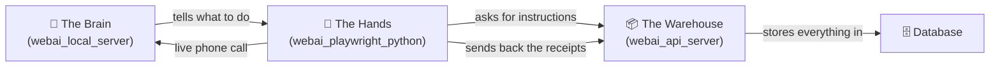
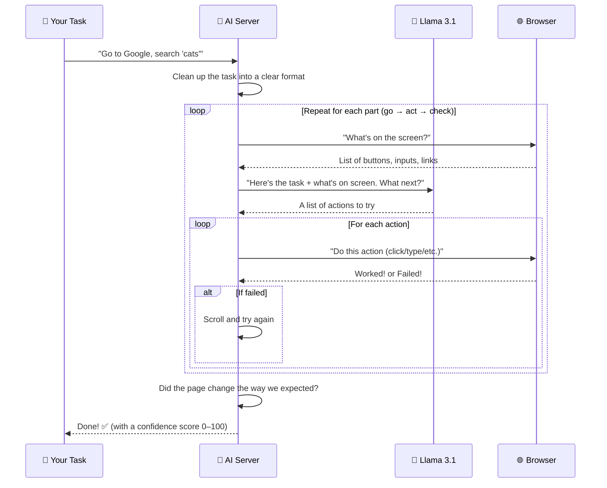

# 🤖 WebAI Platform — A Beginner's Guide

> **Who this is for:** Someone who just opened this project for the first time and wants to understand what it does, how it works, and how to run it — without needing a computer science degree.
>
> **Read time:** ~15 minutes. No prior knowledge of this project is assumed.

---

## 📌 Start Here: What Is WebAI?

**WebAI is a tool that watches you use a website, remembers what you did, and then does it again for you automatically — like a robot pressing the buttons for you.**

### A real-world analogy

Think of it like a **tape recorder for your browser**:

1. You press "record" and use a website normally (click a button, type your name, go to another page).
2. WebAI records every action — like a tape recorder captures sound.
3. Later, you press "play" and WebAI opens a browser and repeats those exact actions — like playing the tape back.
4. The clever part: if the website has changed a little (a button moved, a color changed), WebAI is smart enough to still find the right button and click it. It "heals itself."

### Why does this exist?

Tools like **UiPath** do this kind of thing, but they have two big problems:
- They cost **a lot of money** (expensive licenses).
- They break easily — if a website changes even slightly, a UiPath automation stops working and a human has to fix it.

WebAI fixes both:
- It's **free** and runs entirely on your own computer.
- It captures **10+ different ways** to find each button, so if one way breaks, it tries the next. No human fix needed.

---

## 🗺️ Project Folder Map

Before diving in, here's what each folder in this project contains. The project root is `d:/AI/AILearn/WEBAI_AUTOMATION`.

```
WEBAI_AUTOMATION/
│
├── walkthrough.md                  ← You are reading this file right now
│
├── memory-bank/                    ← Documentation written for developers
│   ├── projectbrief.md             The 1-page "what is this" summary
│   ├── productContext.md           Why the project exists + user stories
│   ├── systemPatterns.md           How the code is organized (architecture)
│   ├── techContext.md              Tech stack, ports, setup commands
│   ├── decisionLog.md              Why certain choices were made
│   ├── progress.md                 What's built vs. what's left
│   └── activeContext.md            Current session notes (changes often)
│
├── webai_api_server/               ← COMPONENT 1: The "Warehouse" (database + API)
│   ├── main.py                     All the API endpoints (the front door)
│   ├── models.py                   Defines the database tables
│   ├── crud.py                     Create/Read/Update/Delete operations
│   ├── auth.py                     Passwords, login tokens, API keys
│   ├── encryption.py               Locks up secrets (passwords) safely
│   ├── database.py                 Connects to Microsoft SQL Server
│   ├── utils.py                    Replaces {{placeholders}} with real values
│   ├── log_crud.py                 Saves and fetches execution logs
│   ├── run.py                      Starts the API server
│   ├── init_db.py                  Creates the database tables (run once)
│   ├── .env                        Secret settings (DB password, encryption key)
│   └── test_*.py                   Test scripts
│
├── webai_local_server/             ← COMPONENT 2: The "Brain" (AI)
│   └── webai_local_server/
│       ├── local_webai_server_guided.py  The big AI brain (1,647 lines)
│       └── server_logger.py              Sends logs to the warehouse
│   (Note: there's a broken "shim" file — always run the _guided version directly)
│
└── webai_playwright_python/        ← COMPONENT 3: The "Hands" (browser robot)
    ├── record_then_run.py          Record your actions, then optionally replay
    ├── run_from_database.py        Fetch a saved automation and replay it
    ├── run_from_task_txt_guided.py Run a task described in plain English
    ├── import_to_database.py       Upload a recording to the database
    ├── recorded_steps.json         A saved recording (example data)
    ├── generated_task.txt          A task description in plain English
    ├── webai.config.json           Connection settings (token, port)
    └── webai_playwright/           The actual robot code
        ├── recorder.py             Watches you and records actions (1,989 lines)
        ├── ai.py                   Routes commands from the brain to the browser
        ├── playwright_actions.py   Actually clicks, types, scrolls
        ├── fallback_helpers.py     The "try the next key" resilience layer
        ├── cdp.py                  Low-level Chrome control (screenshots, DOM)
        └── websocket_client.py    Talks to the brain over a live connection
```

---

## 🏭 The Big Picture in 60 Seconds

WebAI is **three separate programs** that work together like three workers in a factory:



| Worker | Real Name | Job | Analogy |
|--------|-----------|-----|---------|
| 📦 **The Warehouse** | `webai_api_server` | Stores users, recordings, settings, and logs in a database | A filing cabinet that keeps everything organized and safe |
| 🧠 **The Brain** | `webai_local_server` | Uses AI to figure out what actions to take | A smart manager who reads the task and decides the steps |
| 🤖 **The Hands** | `webai_playwright_python` | Opens a real browser and clicks/types/scrolls | A robot sitting at a keyboard doing the actual work |

---

## 🤝 How the Three Workers Talk to Each Other

There are **two ways** these programs communicate. Here's the plain-English version:

### 1. REST API (like sending mail) 📮
- The Hands send a **request** to the Warehouse and **wait for a reply**.
- Example: "Hey Warehouse, give me automation #5." → Warehouse replies with the steps.
- Used for: fetching recordings, saving logs, login.
- One request → one reply. Then the connection closes.

### 2. WebSocket (like a phone call) 📞
- The Hands and the Brain open a **live connection that stays open**.
- They can send messages back and forth instantly, many times.
- Used for: the Brain telling the Hands "click this", "type that", and the Hands replying "done" or "failed".
- This is needed because automation is a fast back-and-forth conversation.

**Why two ways?** Mail (REST) is great for one-off requests. A phone call (WebSocket) is better when you need a continuous conversation.

---

## 📦 Component 1: The Warehouse (`webai_api_server`)

> *"I store everything safely and hand it back when asked."*

This is a **web server** (built with a tool called FastAPI) that talks to a **Microsoft SQL Server database**. It's the central storage for the whole system.

### What it stores (think of each as a drawer in a filing cabinet)

| Drawer (Table) | What's Inside | Plain-English |
|----------------|---------------|---------------|
| **Users** | Usernames, emails, locked passwords, API keys | Accounts — like signing up for a website |
| **Automations** | Recorded browser steps saved as text (JSON) | Recipe book — each recipe is a list of clicks/types |
| **AutomationConfigs** | Your personal settings + locked secrets | Your personal notebook — your username/password for a site |
| **ExecutionHistory** | When each automation ran, did it succeed, how long | A logbook — "ran recipe #5 at 3 PM, took 12 sec, worked" |
| **ExecutionLogs** | Step-by-step detail of each run | A diary — "Step 1: clicked Login, Step 2: typed email..." |
| **ScheduledRuns** | Recurring schedules (e.g., "every day at 9 AM") | An alarm clock for automations |

### The most important files

| File | What It Does |
|------|--------------|
| [`main.py`](webai_api_server/main.py:1) | The front door — defines every API endpoint (login, save automation, run, view logs) |
| [`models.py`](webai_api_server/models.py:1) | The blueprints — says what each database table looks like |
| [`crud.py`](webai_api_server/crud.py:1) | The librarian — creates, reads, updates, deletes records |
| [`auth.py`](webai_api_server/auth.py:1) | The bouncer — checks passwords, hands out tokens and API keys |
| [`encryption.py`](webai_api_server/encryption.py:1) | The vault — locks up secrets (like website passwords) so even if someone steals the database, they can't read them |
| [`utils.py`](webai_api_server/utils.py:1) | The fill-in-the-blanks tool — replaces `{{username}}` placeholders with real values |
| [`database.py`](webai_api_server/database.py:1) | The cable — connects Python to Microsoft SQL Server |

### Security, explained simply

- **Passwords** are scrambled with a one-way recipe called **bcrypt**. Even we can't unscramble them — we can only check if a login password matches.
- **API keys** are long random passwords that scripts use to prove who they are (so they don't need your username/password each time).
- **Secrets** (like your IRCTC password) are locked with **Fernet encryption** — think of it as putting them in a locked safe. The key to the safe lives in the `.env` file, **not** in the database. ⚠️ If you lose that key, the locked secrets are gone forever.

---

## 🧠 Component 2: The Brain (`webai_local_server`)

> *"I read the task, think about what steps are needed, and tell the Hands what to do."*

This is a **WebSocket server** (a program that keeps a live phone-call connection open with the browser robot). When the robot connects, the Brain:

1. Receives a **task** in plain English (e.g., "Go to Google and search for 'cats'").
2. **Asks an AI model** (a free, local one called **Llama 3.1** running via **Ollama**) to plan the steps.
3. **Sends commands** to the Hands, one at a time, and waits for each result.
4. **Checks** whether the task actually succeeded, and retries if something failed.

### The main file: [`local_webai_server_guided.py`](webai_local_server/webai_local_server/local_webai_server_guided.py:1)

This is the **largest file in the project** (1,647 lines). It's the heart of the AI logic.

### Two modes of thinking

The Brain has **two modes**, depending on whether you gave it a recording or just a plain-English task:

| Mode | When It's Used | How It Works | Speed |
|------|----------------|--------------|-------|
| **Guided mode** | You recorded steps earlier | Just replays your recorded steps, using the fallback system to find each button | ⚡ Very fast (no AI needed) |
| **Freeform mode** | You only wrote a task in English | Asks the AI to plan each action from scratch by looking at what's on screen | 🐢 Slower (AI thinks each step) |

**The clever trick:** In guided mode, the Brain **skips the AI entirely** for clicks and typing — it just sends the recorded locators directly. This makes guided mode about 10× faster than freeform mode.

### How the AI planning loop works



### Things the Brain can tell the Hands to do

| Action | Example | What Happens |
|--------|---------|--------------|
| `goto` | Go to `https://google.com` | Open a webpage |
| `click` | Click the "Sign in" button | Click something |
| `type` | Type "hello" into the Email field | Type text into a box |
| `select` | Choose "India" from the Country dropdown | Pick a dropdown option |
| `scroll_page` | Scroll down | Move the page up/down |
| `press_key` | Press Enter | Hit a keyboard key |
| `wait_text` | Wait until "Welcome" appears | Pause until text shows up |
| `verify_url` | Check the URL contains "dashboard" | Confirm we landed on the right page |
| `extract` | Pull text off the page | Scrape a piece of data |
| `extract_table` | Pull a whole table, page by page | Scrape a multi-page table |
| `wait` | Wait 5 seconds | Pause (useful for slow-loading sites) |
| `done` | Task is finished | Stop |

### Data extraction (scraping)

The Brain can pull data off web pages and save it to files:
- 📄 **Text files** (`.txt`)
- 📊 **Excel files** (`.xlsx`)
- 📝 **Word documents** (`.docx`)
- 📑 **CSV files** (`.csv`)

It can even scrape **multi-page tables** — it clicks the "Next" button automatically, waits for the page to change, and keeps going until it has all the rows.

---

## 🤖 Component 3: The Hands (`webai_playwright_python`)

> *"I open a real browser and actually click, type, and scroll."*

This uses **Playwright** (a tool from Microsoft for controlling browsers) to drive a real **Chromium** browser. It does two jobs:

### A) Recording Mode — watching you

The file [`recorder.py`](webai_playwright_python/webai_playwright/recorder.py:1) (1,989 lines) injects a bit of JavaScript into web pages to watch what you do:

- **Clicks** — records what you clicked, plus **10+ different ways** to find that element again later (more on this below).
- **Typing** — records what you typed and into which field.
- **Key presses** — Enter, Tab, Escape, arrows.
- **Navigation** — when the page URL changes.
- **Right-click menu** — you can right-click an element to extract text, extract a table, or add a delay.

While recording, you'll see:
- A **Stop Recording** button in the bottom-right corner.
- **Visual hints** showing each action you took.
- You can stop with the button, `Ctrl+Shift+S`, `Ctrl+Alt+S`, or `Esc`.

### B) Playback Mode — doing it for you

Several files work together:

| File | Role |
|------|------|
| [`ai.py`](webai_playwright_python/webai_playwright/ai.py:1) | The switchboard — receives commands from the Brain and routes them to the right handler |
| [`playwright_actions.py`](webai_playwright_python/webai_playwright/playwright_actions.py:1) | The muscles — actually clicks, types, scrolls, selects, waits |
| [`cdp.py`](webai_playwright_python/webai_playwright/cdp.py:1) | Low-level Chrome control — screenshots, DOM snapshots, finding elements |
| [`fallback_helpers.py`](webai_playwright_python/webai_playwright/fallback_helpers.py:1) | The resilience layer — if the first way to find a button fails, tries the next |
| [`websocket_client.py`](webai_playwright_python/webai_playwright/websocket_client.py:1) | The phone — keeps the live connection to the Brain |
| [`config.py`](webai_playwright_python/webai_playwright/config.py:1) | Settings — the token and WebSocket address |

---

## 🔑 The Secret Sauce: Self-Healing (Why WebAI Beats UiPath)

This is the most important idea in the whole project. Here's the plain-English version.

### The problem with old tools

Traditional tools (like UiPath) find a button using **one** identifier — usually a CSS selector or an ID. So they record something like: *"click the button with id=`btn-login`."*

Then the website gets redesigned and the button's ID changes to `btn-auth`. The automation **breaks instantly**, and a human has to:
1. Open the tool
2. Find the broken step
3. Update the selector
4. Re-test
5. Re-deploy

That's about **4 hours of human work** every time a website changes.

### WebAI's solution: 10 spare keys

When WebAI records you clicking a button, it doesn't just remember one way to find it — it remembers **10+ different ways**, like having 10 spare keys for the same lock:

```
Priority 1: test-id      (the developer's own tag — almost never changes)
Priority 2: id           (the HTML id)
Priority 3: name        (form field name)
Priority 4: placeholder (the grey hint text in a field)
Priority 5: role        (ARIA role + name, e.g., "button" named "Submit")
Priority 6: label       (the text of an associated <label>)
Priority 7: href        (for links)
Priority 8: css         (a CSS selector)
Priority 9: text        (the visible text on the element)
Priority 10: xpath      (a path through the page structure — last resort)
```

When replaying, WebAI tries them **in order**. If key #1 doesn't fit, it tries #2, then #3... until one works.

**Result:** If a website changes one identifier, the automation **keeps working** by falling back to another. No human fix needed. This is what we call **self-healing automation**.

> ⚠️ **Known quirk:** The Brain and the Hands currently have **slightly different lists** of which locator to try first. The Brain knows 13 types; the Hands only know 9. This is a known issue (see [`progress.md`](memory-bank/progress.md:1)) and doesn't break things, but it's on the to-fix list.

---

## 📋 Step-by-Step: How to Actually Use It

> These are real commands you can run. You'll need **4 terminal windows** open at once.

### First-time setup (do this once)

1. **Install ODBC Driver 17 for SQL Server** (lets Python talk to the database)
   - Download from Microsoft, or run: `choco install sql-server-odbc-driver`

2. **Create the database** — open SQL Server Management Studio (SSMS) and run:
   ```sql
   CREATE DATABASE webai_automation;
   GO
   USE webai_automation;
   GO
   ```

3. **Install Python dependencies** (in 3 separate folders):
   ```powershell
   cd webai_api_server
   pip install -r requirements.txt

   cd ..\webai_playwright_python
   pip install -r requirements.txt
   pip install openpyxl python-docx pandas requests

   playwright install chromium
   ```

4. **Create the database tables** (run once):
   ```powershell
   cd webai_api_server
   python init_db.py
   ```

5. **Download the AI model** (for freeform mode only):
   ```powershell
   ollama pull llama3.1
   ```

### Starting the system (3 terminals, kept running)

Open **three** terminals and start one server in each:

**Terminal 1 — The Warehouse (API server):**
```powershell
cd webai_api_server
python run.py
```
→ Runs at http://localhost:8000 (API docs at /docs)

**Terminal 2 — The Brain (AI server):**
```powershell
cd webai_local_server
python -m webai_local_server.local_webai_server_guided
```
→ Runs at ws://localhost:8765

**Terminal 3 — The AI model (Ollama):**
```powershell
ollama serve
```
→ Runs at http://localhost:11434 (only needed for freeform mode)

### Using the system (a 4th terminal)

**Flow 1 — Record, save, and replay:**
```powershell
cd webai_playwright_python

python record_then_run.py        # 📹 Record your actions in the browser
python import_to_database.py     # 📤 Upload the recording to the database
python run_from_database.py      # ▶️ Replay it later (asks for an automation ID)
```

**Flow 2 — Let the AI do a freeform task:**
1. Write your task in [`generated_task.txt`](webai_playwright_python/generated_task.txt:1), e.g.:
   ```
   Open https://google.com and search for 'web automation'
   ```
2. Run:
   ```powershell
   python run_from_task_txt_guided.py
   ```

### Existing test credentials (already in the database)

| Item | Value |
|------|-------|
| Username | `mariselvam` |
| API Key | `o3-pxCyR0eY8dqI-iCHW6AVGGwrjQU8aJw-VBIt1f-8` |
| Example automation ID | `1` (a Sastra.edu navigation) |
| WebSocket token | `local-dev` |

---

## 📊 Data Extraction, Made Simple

WebAI can also **scrape data** off web pages — like copy-paste, but on autopilot.

### While recording
- **Right-click** any element → a menu appears with options:
  - **Extract Text** — grab the text of an element
  - **Extract Attribute** — grab a specific attribute (like a link's `href`)
  - **Extract Table** — grab a whole table, even across multiple pages
  - **Add Delay** — insert a "wait 5 seconds" step
- You'll be asked to **name the variable** (e.g., `exchange_rate`) and pick **save formats** (Excel/Word/TXT).
- The element gets a **green outline** so you know it was marked for extraction.

### While replaying
- The Hands try each locator in priority order until they find the element.
- The extracted value is stored under the variable name you chose.
- If you picked save formats, the data is written to those files automatically.

### Table extraction with pagination
For big multi-page tables, WebAI:
1. Reads the rows on the current page.
2. Creates a "fingerprint" (hash) of the rows so it can tell if the page actually changed.
3. Clicks the **Next** button.
4. Waits for the table to change (checking every 100ms).
5. Repeats until it hits the max page count, runs out of "Next" buttons, or times out.
6. Combines all rows and saves them to Excel/CSV/TXT.

---

## ✅ What's Built vs. 🔲 What's Coming

### ✅ Already working
- Recording clicks, typing, navigation, key presses
- 10+ locator strategies per element (self-healing)
- Saving recordings to the database and replaying them by ID
- AI freeform mode (Llama 3.1 plans actions from plain English)
- Right-click menu for extraction (text, attribute, table, delay)
- Saving scraped data to Excel/Word/TXT/CSV
- Multi-page table scraping with duplicate detection
- User accounts with locked passwords and API keys
- Encrypted secret storage (Fernet)
- Execution history + detailed step-by-step logs
- IST timezone columns (so times show in Indian time)
- Cron-based scheduling (e.g., "run every day at 9 AM")
- Add-delay action (1–60 seconds)

### 🔲 Not yet built (future plans)
- **Conditional branching** — e.g., "if the extracted price is greater than 70, raise a Jira ticket"
- **Jira/incident ticket integration**
- **Variable persistence across steps** (currently variables only live during one run)
- Explicit page validation after navigation
- Multi-browser support (Firefox/WebKit — currently Chromium only)
- A visual drag-and-drop designer (no-code interface)
- Cloud deployment (currently local-only)

---

## 🛠️ Common Problems & Fixes

| Problem | Likely Cause | Fix |
|---------|--------------|-----|
| `pyodbc.InterfaceError: ('IM002', ...)` | ODBC Driver 17 not installed | Install it from Microsoft's site |
| `Cannot open database 'webai_automation'` | Database not created yet | Run the `CREATE DATABASE` SQL above in SSMS |
| `Login failed for user 'sa'` | Wrong password in `.env` | Check `DATABASE_URL` in [`webai_api_server/.env`](webai_api_server/.env:1) matches your SQL Server |
| API server won't start | Port 8000 already in use | Close the other program, or change the port in [`run.py`](webai_api_server/run.py:1) |
| Freeform mode hangs | Ollama not running | Start it: `ollama serve` (Terminal 3) |
| `local_webai_server.py` import error | You ran the broken "shim" file | Always run `local_webai_server_guided` directly (see commands above) |
| Automation fails to find a button | Website changed too much | Re-record, or check the logs at `GET /executions/{id}/logs` |
| Encryption key error | `.env` missing or key invalid | Run `python encryption.py` to generate a new key ⚠️ (old encrypted secrets become unreadable) |
| Logs not showing up | API server not running, or batch not flushed | Make sure the API server is up; logs flush at end of execution |

---

## 📖 Glossary (every technical term, defined in one line)

| Term | Plain-English Meaning |
|------|----------------------|
| **API** | A way for programs to talk to each other over the web |
| **REST API** | An API where each request is independent (like sending a letter) |
| **WebSocket** | A live, stay-open connection between two programs (like a phone call) |
| **FastAPI** | A Python tool for building REST APIs quickly |
| **MSSQL / SQL Server** | Microsoft's database system — like a giant spreadsheet that stores data in tables |
| **ODBC** | A bridge that lets Python talk to Microsoft's database |
| **SQLAlchemy** | A Python library that turns Python code into database queries (so you don't write raw SQL) |
| **ORM** | "Object-Relational Mapper" — SQLAlchemy is one. It maps database tables to Python classes |
| **Playwright** | Microsoft's library for controlling real browsers (Chromium, Firefox, WebKit) |
| **Chromium** | The open-source browser that Google Chrome is built on |
| **CDP** | Chrome DevTools Protocol — a low-level way to control Chrome (screenshots, DOM, etc.) |
| **DOM** | "Document Object Model" — the tree-like structure of a web page that programs can read |
| **Ollama** | A tool that runs AI models locally on your own computer (no internet needed) |
| **Llama 3.1** | A free, open-source AI model from Meta — WebAI's default "brain" |
| **LLM** | "Large Language Model" — an AI that understands and generates text (like ChatGPT) |
| **Locator** | A way to find a specific element on a web page (by ID, text, role, etc.) |
| **XPath** | A path language for finding elements in a web page's structure — powerful but brittle |
| **JSON** | A text format for storing structured data — looks like `{"key": "value"}` |
| **Pydantic** | A Python library that checks data shapes (validates that an email looks like an email, etc.) |
| **bcrypt** | A one-way password scrambling recipe — you can check a password but can't unscramble it |
| **JWT** | "JSON Web Token" — a time-limited pass that proves you're logged in |
| **API Key** | A long random password that scripts use instead of your real password |
| **Fernet** | A symmetric encryption recipe (from the `cryptography` library) — same key locks and unlocks |
| **Symmetric encryption** | One key both locks and unlocks (vs. asymmetric, which uses two keys) |
| **Cron** | A schedule format, e.g., `0 9 * * *` means "every day at 9 AM" |
| **croniter** | A Python library that understands cron schedules |
| **IST** | Indian Standard Time (UTC + 5:30) — the database stores UTC but shows IST in computed columns |
| **UTC** | Coordinated Universal Time — the world's base time, no timezone offset |
| **Fallback** | Trying the next option when the first one fails |
| **Confidence score** | A 0–100 rating of how sure the Brain is that the task succeeded |
| **Guided mode** | Replaying recorded steps (fast, no AI needed for clicks/types) |
| **Freeform mode** | Letting the AI plan each step from scratch (slower, more flexible) |
| **Shim** | A small file that redirects imports to another module — the one in this project is broken |

---

## 🎯 TL;DR (Too Long; Didn't Read)

**WebAI = a free, local, self-healing web automation tool.**

- **Record** yourself using a website → it remembers 10+ ways to find each button.
- **Save** the recording to a database → reuse it anytime by ID.
- **Replay** it later → if the website changed, it tries the next locator automatically.
- **Or** just write a task in English → a local AI (Llama 3.1) figures out the steps.
- **Scrape** text, attributes, and multi-page tables → save to Excel/Word/TXT/CSV.
- **Log** everything → so you can debug failures and audit runs.

It's like UiPath, but free, private, and smart enough to fix itself when websites change.

---

## 📚 Where to Learn More

If you want to go deeper, read these (in order):

1. [`memory-bank/projectbrief.md`](memory-bank/projectbrief.md:1) — The 1-page summary of what this project is
2. [`memory-bank/productContext.md`](memory-bank/productContext.md:1) — Why it exists and who it's for
3. [`memory-bank/systemPatterns.md`](memory-bank/systemPatterns.md:1) — How the code is organized (architecture)
4. [`memory-bank/techContext.md`](memory-bank/techContext.md:1) — Tech stack, ports, and setup commands
5. [`memory-bank/decisionLog.md`](memory-bank/decisionLog.md:1) — Why certain choices were made
6. [`memory-bank/progress.md`](memory-bank/progress.md:1) — What's built vs. what's left
7. [`memory-bank/activeContext.md`](memory-bank/activeContext.md:1) — Current session notes (changes often)
