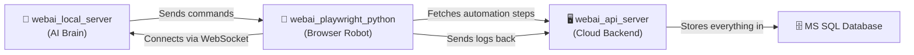
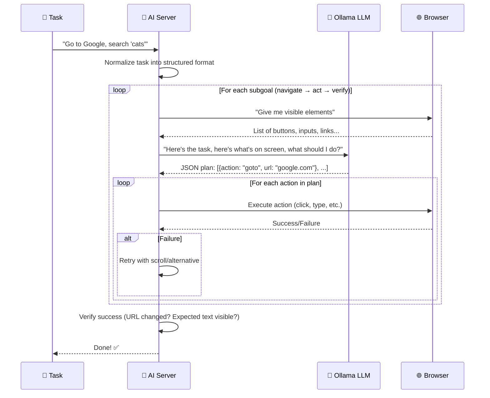
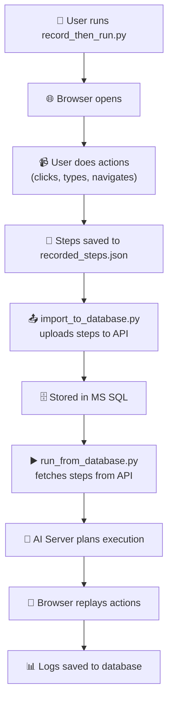
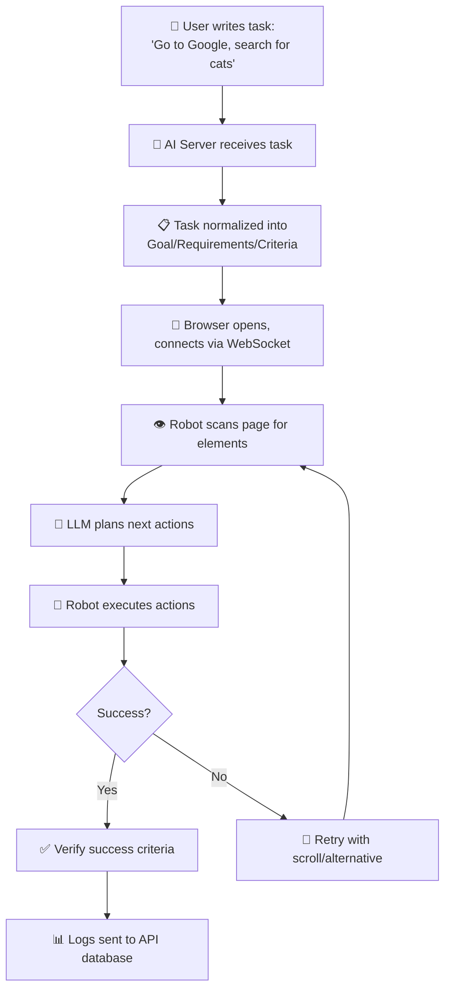

# 🤖 WebAI Platform — Complete Source Code Analysis

## What Is This Project? (The 30-Second Version)

**WebAI is a system that lets you record yourself using a website — clicking, typing, navigating — and then replay those exact actions automatically, like a robot doing it for you.**

Think of it like a macro recorder for the web:
1. You **record** your actions (clicks, typing, page navigation)
2. The system **saves** those steps into a database
3. Later, you can **replay** those steps automatically — the system opens a browser and does everything for you
4. It can also use **AI** (a local LLM like Llama) to intelligently figure out what to do from a plain English task description

---

## The Three Components

The project is split into three separate applications that work together:



| Component | Analogy | What It Does |
|-----------|---------|-------------|
| **webai_api_server** | 📦 The warehouse | Stores users, automations, configs, logs in a database. REST API. |
| **webai_local_server** | 🧠 The brain | Uses AI (Ollama/LLM) to plan what actions to take. WebSocket server. |
| **webai_playwright_python** | 🤖 The hands | Actually opens a browser and clicks/types/scrolls. Records too. |

---

## Component 1: `webai_api_server` — The Cloud Backend

> *"The filing cabinet and security guard"*

This is a **FastAPI web server** that acts as the central database and API for the whole system. It connects to a **Microsoft SQL Server** database.

### What It Stores (Database Tables)

| Table | What It Holds | Real-World Analogy |
|-------|---------------|-------------------|
| **Users** | Usernames, emails, hashed passwords, API keys | User accounts (like signing up for a website) |
| **Automations** | Recorded browser steps as JSON | Recipe book — each recipe is a set of browser actions |
| **AutomationConfigs** | Variables and encrypted secrets per user | Personalized settings — your username/password for a site |
| **ExecutionHistory** | When automations ran, success/failure, timing | A logbook — "ran recipe #5 at 3:00 PM, took 12 sec, succeeded" |
| **ExecutionLogs** | Detailed step-by-step logs | The detailed diary — "Step 1: clicked Login, Step 2: typed email..." |
| **ScheduledRuns** | Cron schedules for recurring automations | Alarm clock — "run this every day at 9 AM" |

### Key Files Explained

| File | Purpose |
|------|---------|
| [main.py](file:///e:/WebAI_Project/webai_api_server/main.py) | **The heart** — All API endpoints (register, login, create/run automations, view logs) |
| [models.py](file:///e:/WebAI_Project/webai_api_server/models.py) | **Database blueprints** — Defines what each table looks like |
| [schemas.py](file:///e:/WebAI_Project/webai_api_server/schemas.py) | **Input/output rules** — Validates what data comes in and goes out |
| [crud.py](file:///e:/WebAI_Project/webai_api_server/crud.py) | **Database operations** — Create, Read, Update, Delete records |
| [auth.py](file:///e:/WebAI_Project/webai_api_server/auth.py) | **Security** — Password hashing (bcrypt), JWT tokens, API key auth |
| [encryption.py](file:///e:/WebAI_Project/webai_api_server/encryption.py) | **Secret keeper** — Encrypts sensitive credentials (passwords for automated sites) using Fernet |
| [database.py](file:///e:/WebAI_Project/webai_api_server/database.py) | **Database connection** — Connects to MS SQL Server via ODBC |
| [utils.py](file:///e:/WebAI_Project/webai_api_server/utils.py) | **Variable substitution** — Replaces `{{username}}` placeholders in steps with actual values |
| [log_crud.py](file:///e:/WebAI_Project/webai_api_server/log_crud.py) | **Log operations** — Save/query/delete execution logs with filtering |
| [log_schemas.py](file:///e:/WebAI_Project/webai_api_server/log_schemas.py) | **Log data shapes** — Defines the structure of log entries |

### API Endpoints Summary

```
POST   /auth/register          → Create account
POST   /auth/login             → Get JWT token + API key

POST   /automations            → Save a recorded automation
GET    /automations            → List your automations
GET    /automations/{id}       → Get automation with all steps
PUT    /automations/{id}       → Update automation
DELETE /automations/{id}       → Delete automation

GET    /templates              → Browse public automation templates
POST   /configs                → Save config (variables + encrypted secrets)
POST   /execute                → Start an execution record
GET    /execute/{id}/steps     → Get steps with variables substituted

GET    /executions             → View execution history
POST   /executions/{id}/logs   → Save a log entry
POST   /logs/batch             → Save many logs at once (efficient)
DELETE /logs/cleanup           → Delete old logs (retention policy)
```

### Security Features

- **Passwords**: Hashed with bcrypt (never stored in plain text)
- **API Keys**: Random 32-byte tokens for machine-to-machine auth
- **JWT Tokens**: Time-limited access tokens for sessions
- **Credential Encryption**: User secrets (like website passwords) are encrypted with Fernet symmetric encryption before being stored in the database

---

## Component 2: `webai_local_server` — The AI Brain

> *"The smart planner who figures out what to do"*

This is a **WebSocket server** that acts as the AI decision-making layer. When the browser robot connects to it, this server:

1. Receives a **task** in plain English (e.g., "Go to Google and search for 'WebAI'")
2. **Asks an AI model** (local Ollama/Llama) to create a step-by-step plan
3. **Sends commands** to the browser robot to execute each step
4. **Verifies** the results and retries if something fails

### Key File: [local_webai_server_guided.py](file:///e:/WebAI_Project/webai_local_server/webai_local_server/local_webai_server_guided.py) (1,647 lines!)

This is the largest and most complex file in the entire project. Here's what it does:

#### The AI Planning Loop



#### Key Concepts in the AI Server

| Concept | What It Does | Analogy |
|---------|-------------|---------|
| **Task Normalization** | Converts "search Google for cats" into a structured Goal/Requirements/Success Criteria format | Turning a casual note into a formal work order |
| **Subgoals** | Splits work into Navigate → Act → Verify phases | Like cooking: prep → cook → taste-test |
| **System Prompts** | Tells the AI what actions are allowed (click, type, scroll, etc.) | Giving the robot its instruction manual |
| **Context Building** | Scans the page for visible interactive elements (buttons, inputs, links) | The robot "looking" at the screen |
| **Action Normalization** | Fixes common AI mistakes (wrong field names, invalid selectors) | Spell-checking the AI's homework |
| **Confidence Scoring** | Rates 0-100 how confident we are the task succeeded | A test score for the automation run |
| **Plan Caching** | Saves successful plans so the same task doesn't need AI again | Remembering the answer so you don't have to think again |
| **Retry Logic** | If an element isn't found, scrolls the page and tries again | "I can't see it, let me scroll down and look again" |

#### Supported Actions (What the AI Can Tell the Browser to Do)

| Action | Example | What Happens |
|--------|---------|-------------|
| `goto` | `{action: "goto", url: "https://google.com"}` | Navigate to a URL |
| `click` | `{action: "click", target: {by: "text", text: "Sign in"}}` | Click a button/link |
| `type` | `{action: "type", target: {by: "label", label: "Email"}, text: "user@email.com"}` | Type into a field |
| `select` | `{action: "select", target: {by: "label", label: "Country"}, option_text: "India"}` | Choose from a dropdown |
| `scroll_page` | `{action: "scroll_page", target: "down"}` | Scroll the page |
| `press_key` | `{action: "press_key", key: "Enter"}` | Press a keyboard key |
| `wait_text` | `{action: "wait_text", text: "Welcome"}` | Wait for text to appear |
| `verify_url` | `{action: "verify_url", contains: "dashboard"}` | Verify the URL changed |
| `extract` | Extracts text/attributes from elements | Scrape data from a page |
| `extract_table` | Extracts table data with pagination | Scrape entire tables, page by page |
| `done` | Task is complete | Stop execution |

#### Data Extraction & Saving

The server can **extract data** from web pages and save it to:
- **Text files** (.txt)
- **Excel files** (.xlsx)
- **Word documents** (.docx)
- **CSV files** (.csv)

It even supports **table extraction with pagination** — clicking "Next" buttons automatically to scrape multi-page tables.

### Supporting File: [server_logger.py](file:///e:/WebAI_Project/webai_local_server/webai_local_server/server_logger.py)

Buffers server-side logs and sends them in batches to the API server for persistent storage. Each action (click, type, etc.) gets a timestamped log entry with metadata.

---

## Component 3: `webai_playwright_python` — The Browser Robot

> *"The hands that actually touch the keyboard and mouse"*

This uses **Playwright** (Microsoft's browser automation library) to control a real Chromium browser. It does two things:

### A) Recording Mode (Watching You)

The [recorder.py](file:///e:/WebAI_Project/webai_playwright_python/webai_playwright/recorder.py) file (1,990 lines!) injects JavaScript into web pages to capture your actions:

- **Clicks**: Records what you clicked, with 10+ different ways to find that element again later:
  - `test-id` → `data-testid` attribute (developer-intended)
  - `id` → HTML `id` attribute
  - `name` → Form field `name`
  - `aria-label` → Accessibility label
  - `placeholder` → Input placeholder text
  - `label` → Associated `<label>` element
  - `css` → CSS selector
  - `text` → Visible text content
  - `role` → ARIA role + name
  - `xpath` → XPath (last resort)
  
- **Typing**: Records what you typed and into which field
- **Key Presses**: Enter, Tab, Escape, arrow keys
- **Navigation**: Page URL changes
- **Verifications**: You can manually add "verify this text exists" checks

The recorder shows:
- A **Stop Recording** button (bottom-right corner)
- **Visual feedback hints** for each recorded action
- A **modal dialog** for verification prompts

### B) Playback Mode (Doing It For You)

Multiple modules work together:

| File | Role |
|------|------|
| [ai.py](file:///e:/WebAI_Project/webai_playwright_python/webai_playwright/ai.py) | **Command router** — Receives commands from the AI server via WebSocket, dispatches them to the right handler |
| [playwright_actions.py](file:///e:/WebAI_Project/webai_playwright_python/webai_playwright/playwright_actions.py) | **Action executor** — Actually clicks, types, scrolls, selects, waits using Playwright's API |
| [cdp.py](file:///e:/WebAI_Project/webai_playwright_python/webai_playwright/cdp.py) | **Low-level browser control** — Uses Chrome DevTools Protocol for screenshots, DOM snapshots, element location |
| [fallback_helpers.py](file:///e:/WebAI_Project/webai_playwright_python/webai_playwright/fallback_helpers.py) | **Resilience layer** — If the first locator doesn't work, tries the next one automatically |
| [websocket_client.py](file:///e:/WebAI_Project/webai_playwright_python/webai_playwright/websocket_client.py) | **Communication** — Connects to the AI server via WebSocket |
| [config.py](file:///e:/WebAI_Project/webai_playwright_python/webai_playwright/config.py) | **Settings** — Token, WebSocket URL, logging flags |

### The Fallback Strategy (What Makes It Reliable)

When the robot needs to click a button, it doesn't just try one way — it tries up to 10 different strategies in priority order:

```
1. test-id  (most stable)     → data-testid="submit-btn"
2. id                         → #submit-btn
3. name                       → [name="submit"]
4. aria-label                 → [aria-label="Submit"]
5. placeholder                → placeholder="Search..."
6. role                       → role="button", name="Submit"
7. label                      → <label>Submit</label>
8. href                       → [href="/submit"]
9. css                        → button.submit-btn
10. xpath  (last resort)      → //form/div[2]/button[1]
```

If #1 fails → try #2, if #2 fails → try #3... This makes automations much more robust against website changes.

### Runner Scripts

| Script | Purpose |
|--------|---------|
| [record_then_run.py](file:///e:/WebAI_Project/webai_playwright_python/record_then_run.py) | Record your actions, then optionally run them back with AI |
| [run_from_task_txt_guided.py](file:///e:/WebAI_Project/webai_playwright_python/run_from_task_txt_guided.py) | Read a task from `generated_task.txt` and execute it via AI |
| [run_from_database.py](file:///e:/WebAI_Project/webai_playwright_python/run_from_database.py) | Fetch automation from API database and execute it |
| [import_to_database.py](file:///e:/WebAI_Project/webai_playwright_python/import_to_database.py) | Upload a `recorded_steps.json` file to the API database |

---

## End-to-End Flow: How Everything Works Together

### Flow 1: Record → Save → Replay



### Flow 2: AI-Driven Task Execution



---

## Summary Table

| Aspect | Detail |
|--------|--------|
| **Language** | Python |
| **Web Framework** | FastAPI (API server) |
| **Database** | Microsoft SQL Server (MSSQL via pyodbc) |
| **Browser Automation** | Playwright (Chromium) |
| **AI/LLM** | Ollama (local, default model: Llama 3.1) |
| **Communication** | REST API (HTTP) + WebSockets |
| **Security** | bcrypt passwords, JWT tokens, API keys, Fernet encryption |
| **Logging** | Structured logs with levels (INFO/WARN/ERROR/DEBUG), batch upload, retention policy |
| **Data Extraction** | Text, attributes, tables with pagination → TXT/Excel/Word/CSV |
| **Resilience** | 10-strategy locator fallback, retry loops, confidence scoring |
